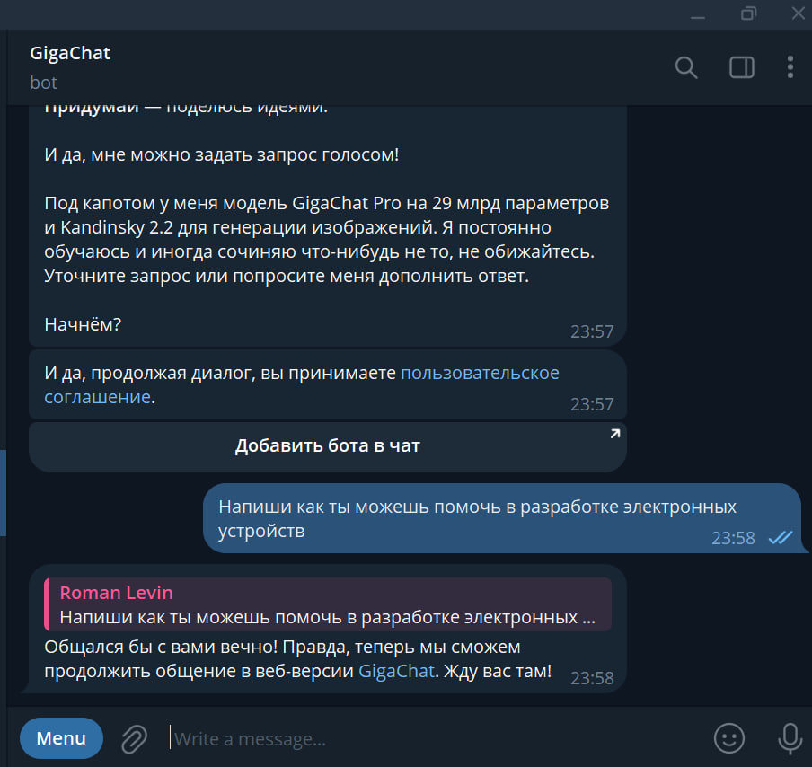
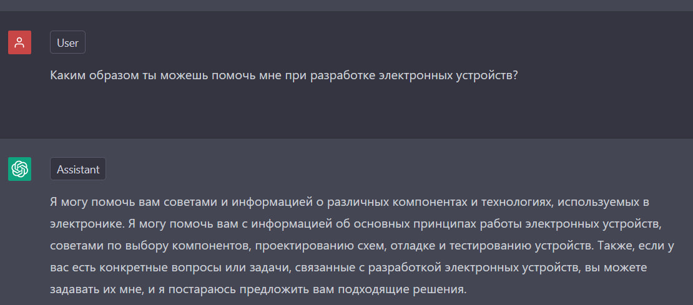
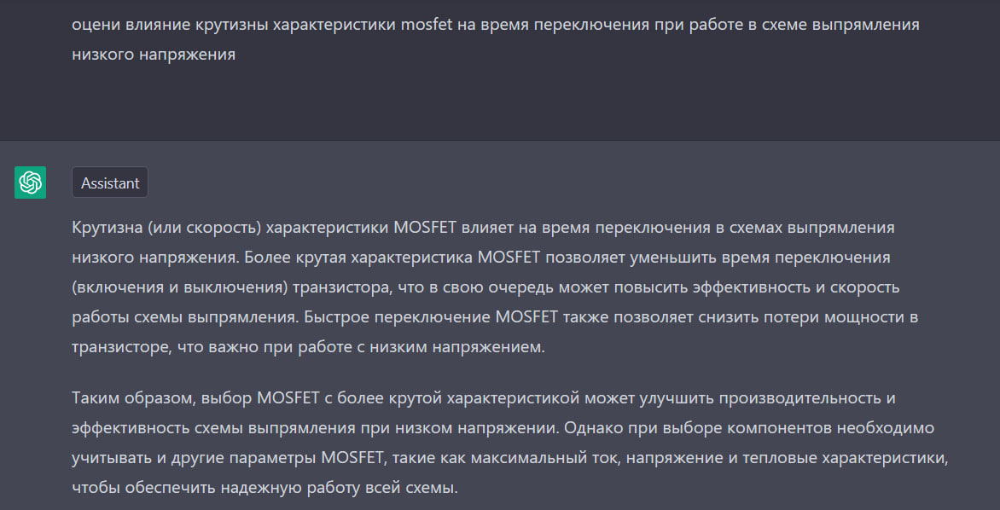
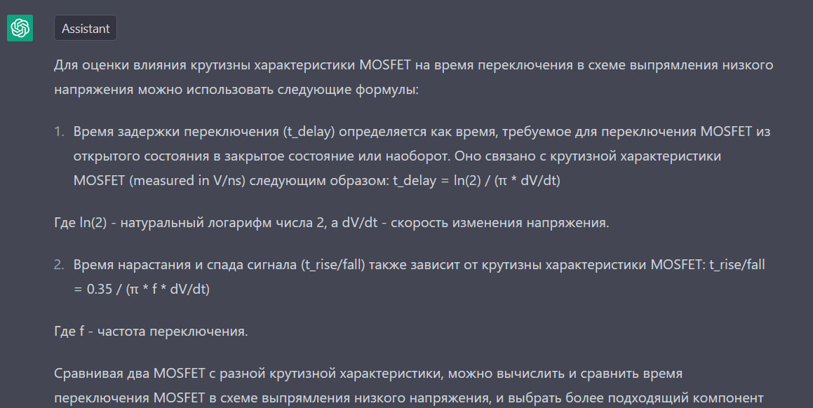
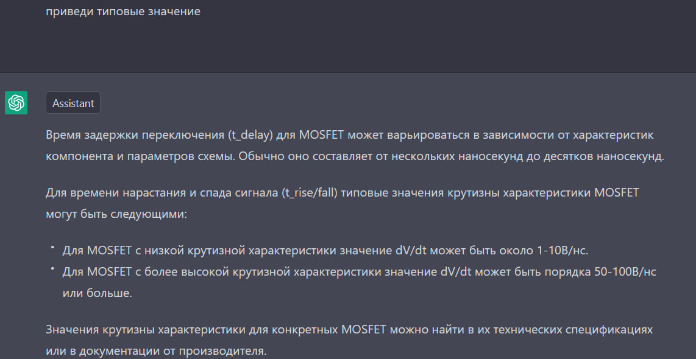
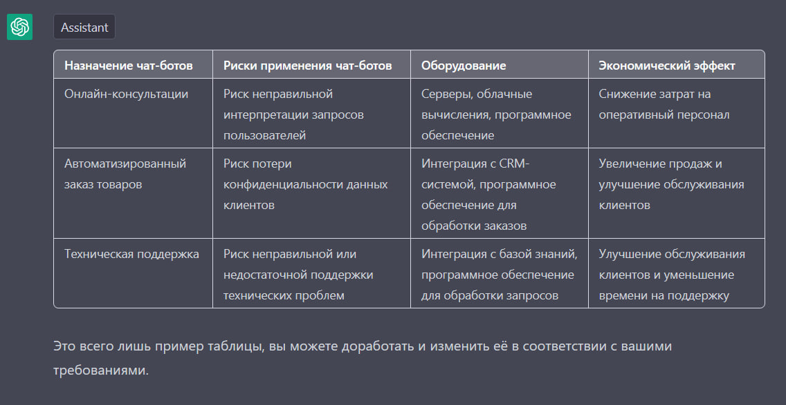
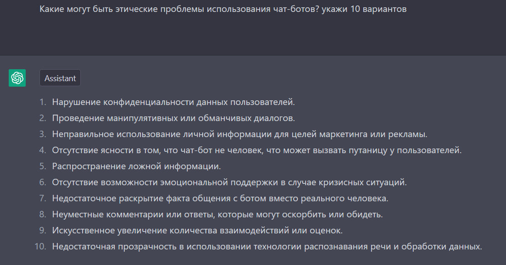

# Введение в искуственный интеллект

## Решение задач семинара 1

### Задание

Необходимо составить отчет.
Выберите для общения два любых чат-бота, но обязательно один из них разработан в РФ.
Получить доступ к ChatGPT можно черезе Edge -> BING, но включив VPN
Опишите в отчете выбранные чат-боты, особенности и различия их работы.
Опишите в отчете свою сферу деятельности.
Поспрашивайте у чат-ботов о самых каверзных моментах своей работы, о сложных технических деталях. В отчете приложите скрины основных моментов общения.
Опишите в таблице где и и как можно применить чат-боты, какие существуют риски, какое оборудование нужно, какой экономический эффект это даст предприятияю.
Оцените этические проблемы такого использования.

### Сравнение двух ботов

Проводилось сравнение СБЕР GigaChat и ChatGPT

Поделка от сбера оказалась совершенно бестолковой.
Затруднялась с решением простых логических задач и формулированием верных ответов.
После недолгого общения отказалась общаться без авторизации в своей веб-версии.
К практическому использованию этот инструмент непригоден.

ChatGPT на сегодняшний день показал, пожалуй, самый удачный опыт при формулировке ответов.
Однако, столь же плохо справляется с решением нетривиальных логических задач.

У обоих ботов отсутствует чувство юмора и неформальное общение вызывает их ступор.

### Применение чат-ботов в профессиональной деятельности

Гигачат от сбера бесполезен.

Чат-ГПТ в состоянии внятно поболтать на общие профессиональные темы, без погружения в технические нюансы конкретной реализации.

### Таблица применимости чат-отов

### Оценка этических проблем

