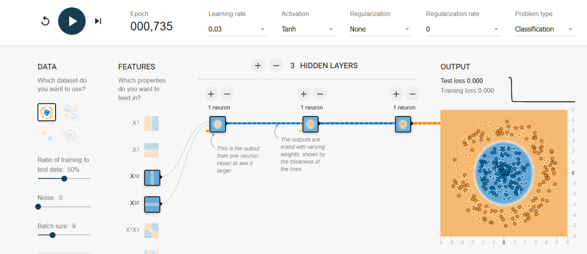
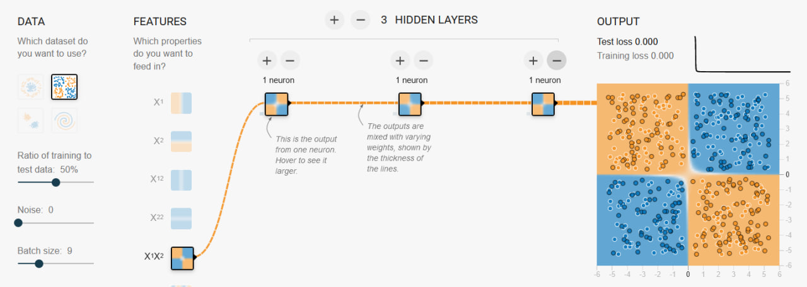
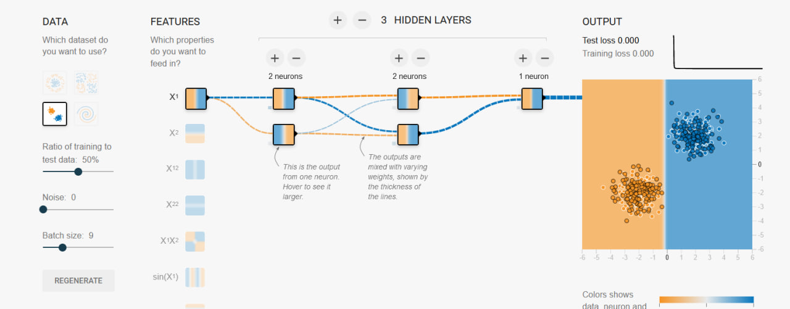
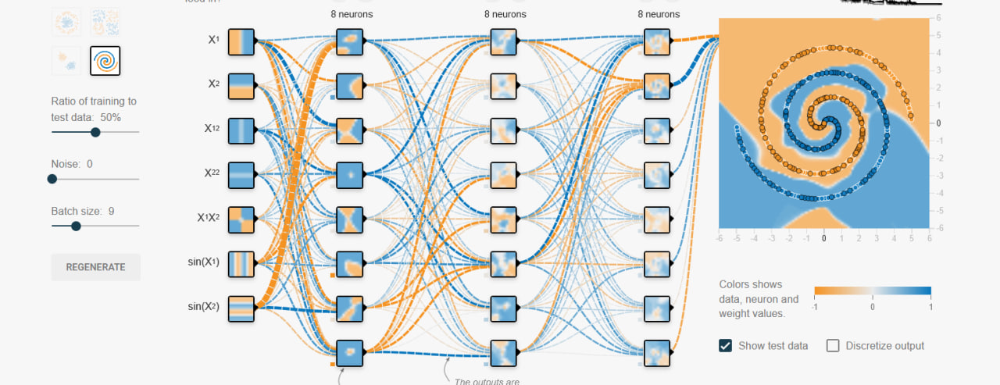

# Введение в искуственный интеллект

## Решение задач семинара 2

### Задание

1. Используйте адрес https://playground.tensorflow.org/ для получения доступа к учебной нейронной сети Tensorflow.
2. Внимательно изучите документацию, расположенную по этому адресу под изображением нейронной сети.
3. Попробуйте поиграться с нейронной сетью, чтобы понять, что происходит и как она работает.
4. При переходе к решению следующей задачи верните все настройки обучения к изначальному состоянию (для этого можно просто перезагрузить страницу).
5. Для каждого из четырёх наборов данных в задаче классификации («Classification») постройте минимальную нейронную сеть, которая осуществляет классификацию соответствующего набора данных. Критерий минимальности обозначает, что нейронная сеть содержит минимальное количество входных фич, минимальное количество промежуточных слоёв и нейронов в них.
6. Напишите краткий отчёт о своих исследованиях. В отчёте для каждого из четырёх наборов данных укажите:
- Параметры обучения.
- Какие фичи использованы.
- Сколько скрытых слоёв и нейронов в них использовано.
- Как быстро сошлась нейронная сеть при обучении.
- Характеристика областей классификации.
- Причины, почему произошло именно так, а не иначе.

### Решение

Ниже приведены скриншоты минимальных нейронных сетей для каждой задачи

Задача 1:

Задача 2:

Задача 3:

Задача 4:

Все достаточно быстро сошлось.

