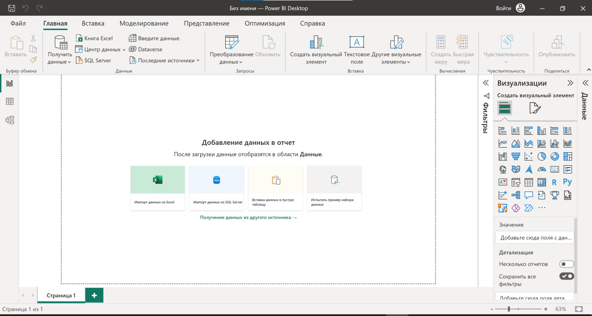

# Решение ДЗ семинара 1
## Введение в BI
## Из каких этапов состоит подготовка отчета

## Задания

1. Скачайте Power BI Desktop - в качестве подтверждения присылайте скрин интерфейса.
2. Распишите подробнее свой путь в аналитике и ожидания от обучения:
3. Есть ли у вас опыт в аналитике и сколько лет?
4. В каком направлении анализа планируете развиваться: BI, бизнес, финансовый, маркетинговый, HR, системный, продуктовая? Возможно вы руководитель или владелец бизнеса, тогда распишите как поможет аналитика в ваших задачах.
5. Какие основные навыки вы хотите освоить?
6. Есть ли у вас уже опыт работы в какой-то BI-системе и если да, то какой?

### Решение задания 1

### Решение задания 2

Путь в профессиональной занятостью аналитикой отсутствует. Только повседневные задачи.
Ожидания от обучения: понимание принципов работы аналитика, освоение основных инструментов и приемов работы.

### Решение задания 3

Опыт в аналитика отсутствует

### Решение задания 4

Мне трудно сходу понять чем существенно отличаются от себя перечисленные виды аналитики, кроме совсем уж очевидных различий, например: HR и финансовый.
Аналитика - это обработка информации перед принятием решения.
Умение руководителя или владельца бизнеса провести анализ критически важной информации может стать конкурентным преимуществом компании.

### Решение задания 5

Понятия не имею про то, какие навыки аналитика существуют, поэтому затрудняюсь сказать что именно хочу освоить.

### Решение задания 6

Опыт работы в BI-системах отсутствует.
