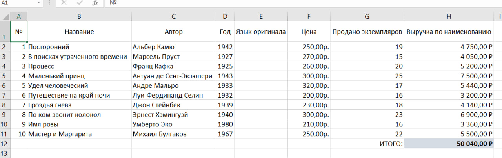

# Решение ДЗ семинара 1
## Основы работы с электронными таблицами

1. Добавьте в таблицу книги столбец «Выручка по наименованию». В него добавьте данные по каждой книге следующего вида: Умножьте цену на количество проданных экземпляров и полученную сумму введите в столбец «Выручка по наименованию». Вы можете использовать калькулятор или иные методы, которые считаете нужными.
1. Найдите суммарную выручку и укажите ее в таблице под столбцом «Выручка по наименованию». Выделите ячейку с этим значением и в соседней ячейке слева напишите «Итого:»

__Решение в файле __Семинар1_данные.xlsx___

### Скриншот решения

