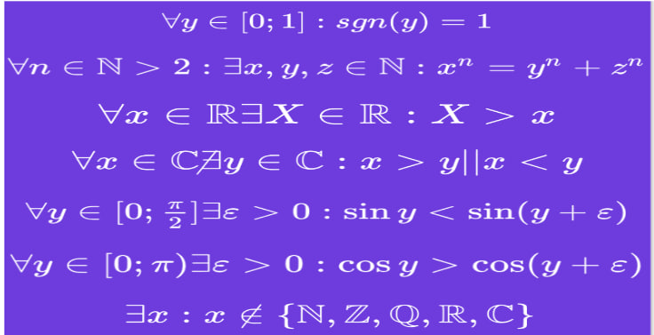
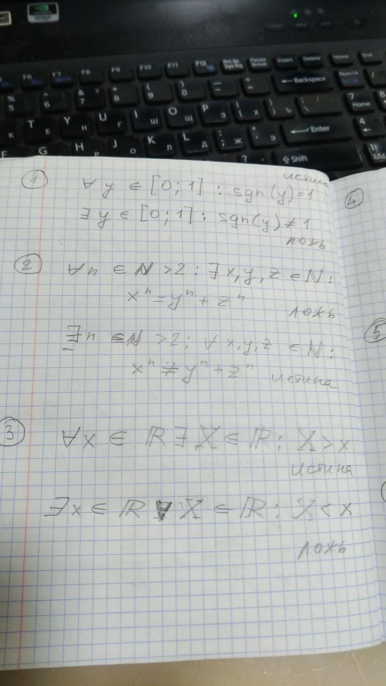
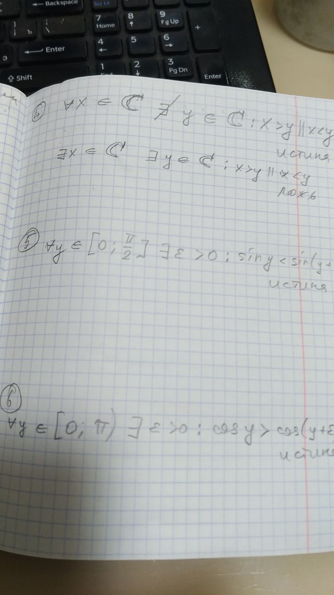
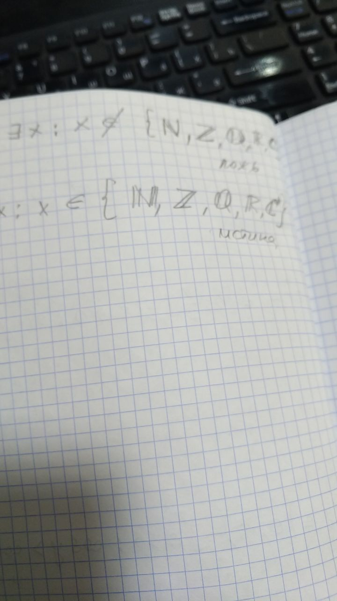
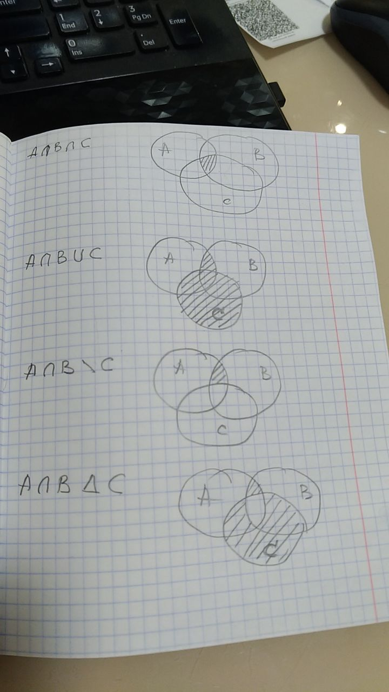
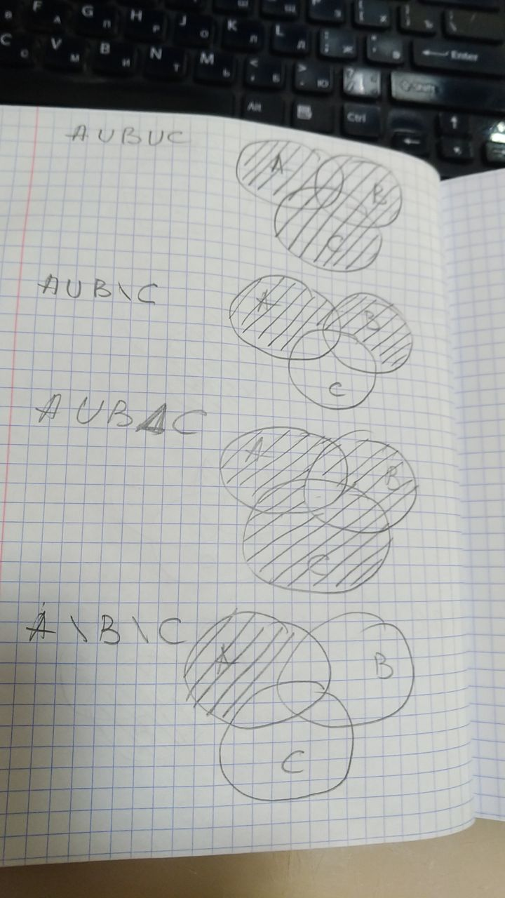
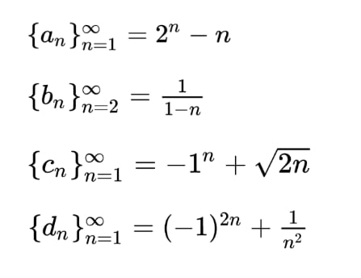
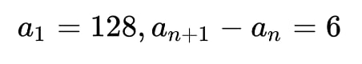
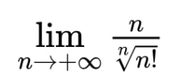

# Решение ДЗ семинаров

## Введение в математический анализ

### Тема 1 “Введение в математический анализ”

1. Как соотносятся понятия “множество” и “последовательность”? (в ответе использовать слова
типа: часть, целое, общее, частное, родитель, дочерний субъект и т.д.)

Множество - это совокупность произвольного числа элементов.
Последовательность - это упорядоченное множество. Порядок определяется тем, что у каждого элемента последовательности
есть порядковый номер, который в последовательности возрастает к каждому следующему элементу. Также каждый член
последовательности имеет свой однозначно определённый номер, те место в последовательности. 

2. Прочитать высказывания математической логики, построить их отрицания и установить
истинность.

Решение:

### Тема 2 “Множество”

1. Даны три множества A, B и C. Необходимо выполнить все изученные виды бинарных операций
над всеми комбинациями множеств.

2. Выполнить задание 1 на языке Python

[Операции над множествами в файле abc.ipynb](./abc.ipynb)

### Тема 3 “Последовательность”

1. Даны 4 последовательности. Необходимо:
a. исследовать их на монотонность;
b. исследовать на ограниченность;
c. найти пятый по счету член.

Решение:
1) a: монотонна, b: ограничена снизу, c: a(5) = 27
2) a: монотонна, b: ограничена сверху, c: b(6) = -0.2
3) a: не монотонна, b: ограничена снизу, c: c(5) = 2.1622776601683795
4) a: монотонна, b: ограничена сверху, c: d(5) = 1.04

[Расчеты в файле 3.1.ipynb](./3.1.ipynb)

2. Найти 12-й член заданной неявно последовательности

Решение:
12-й элемент последовательности равен 194

[Расчеты в файле 3.2.ipynb](./3.2.ipynb)

3. *На языке Python предложить алгоритм вычисляющий численно предел с точностью e = 10e-7

[Решение в файле 3.3.ipynb](./3.3.ipynb)

4. *Предложить оптимизацию алгоритма, полученного в задании 3, ускоряющую его сходимость.
