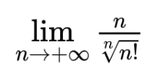

# Решение ДЗ семинаров

## Введение в математический анализ

3. *На языке Python предложить алгоритм вычисляющий численно предел с точностью e = 10e-7

[Решение в файле 3.3.ipynb](./3.3.ipynb)

Предложено два решения:
а) через sympy - для предотвращения переполнения переменной типа float при операциях с факториалами больших чисел;
б) расчет значения функции через логарифмы, с использованием переменных стандартной точности.
