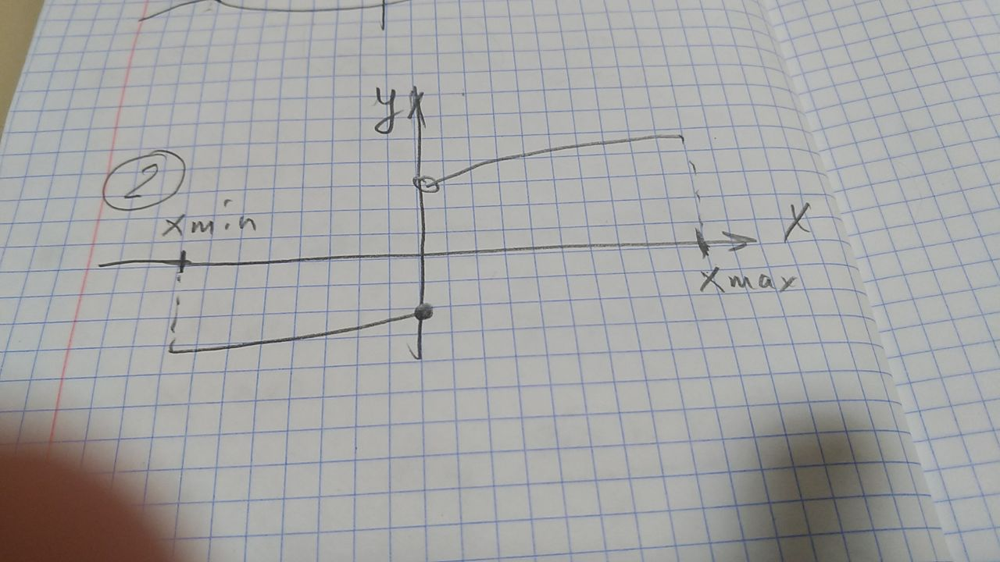
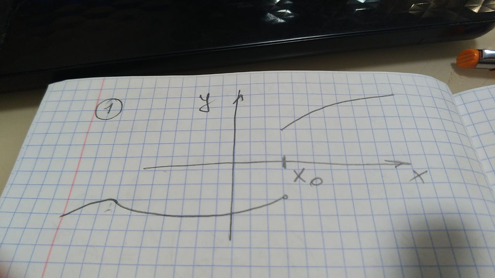
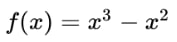
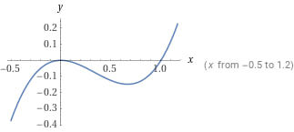
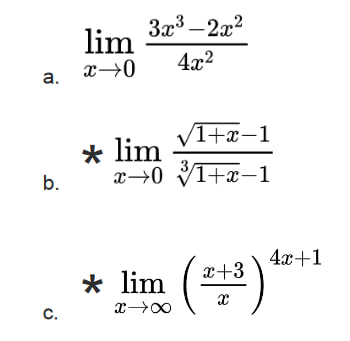
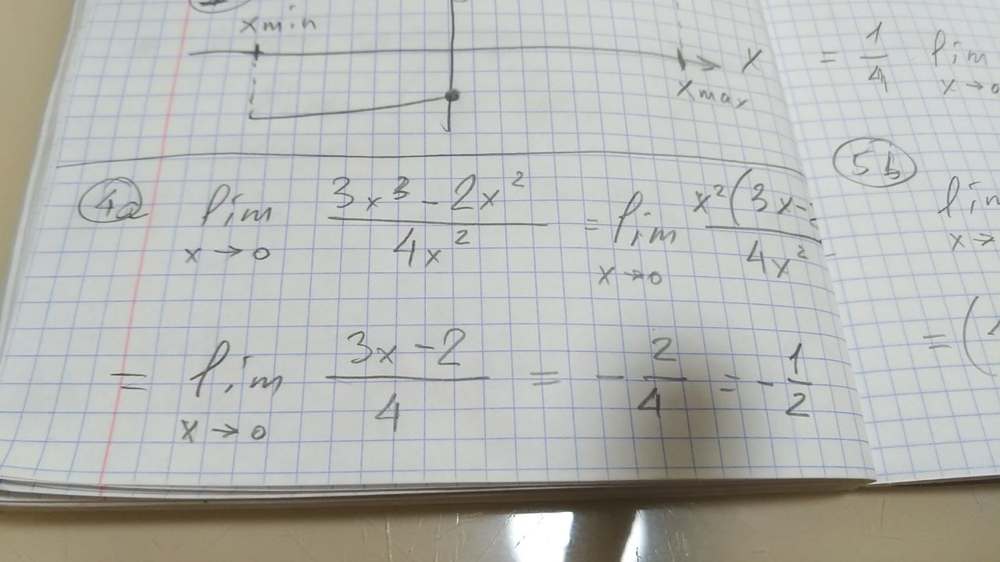
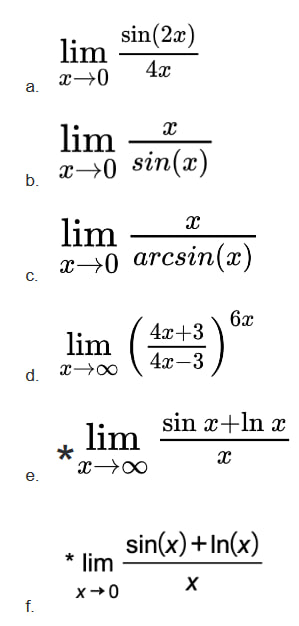
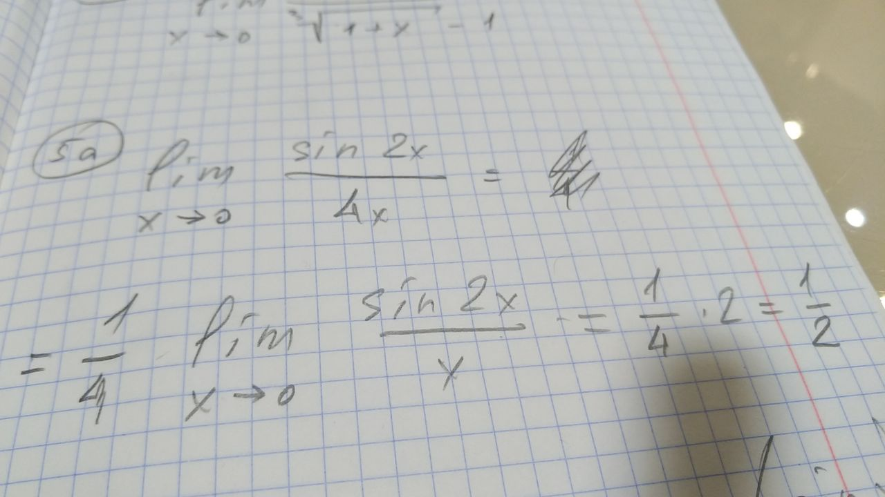
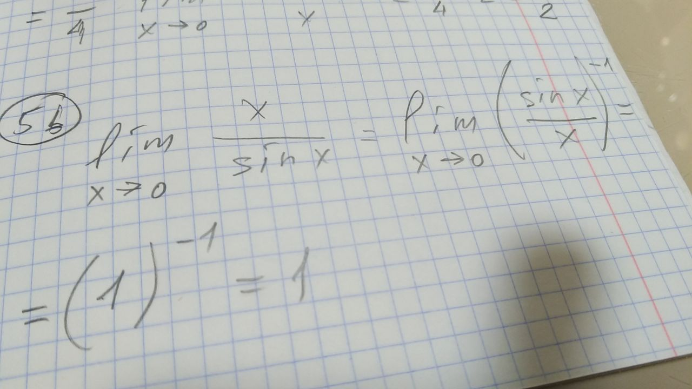

# Решение ДЗ семинаров

## Введение в математический анализ

### Тема “Предел функций”

1. Предложить пример функции, не имеющей предела в нуле и в бесконечностях.

Функция имеет разрыв в 0, и определена на диапазоне от Xmin до Xmax, при этом не имеет предела в 0 и бесконечностях.

2. Привести пример функции, не имеющей предела в точке, но определенной в ней.

Функция определена в точке Х0, но не имеет предела.

3. Исследовать функцию

a. Область задания и область значений.

область определения: от -оо до +оо

область значений: от -оо до +оо

b. Нули функции и их кратность.

Функцию можно представить как: x^2(x-1), таким образом функция пересекает ось х и обращается в 0 в двух точках: х1 = 0 и х2 = 1.

c. Отрезки знакопостоянства.

функция положительна, когда х ∈ (1;+оо],

функция отрицательна на х ∈ [-оо;0) и (0;1) 

d. Интервалы монотонности.

функция монотонно растет на: х ∈ [-оо;0) и (1;+оо],

функция монотонно падает на: х ∈ (0;1)

e. Четность функции.

функция нечетна

f. Ограниченность.

функция неограниченна.

g. Периодичность.

функция непериодична

4. Найти предел

### Тема “Теоремы о пределах”

5. Найти предел

