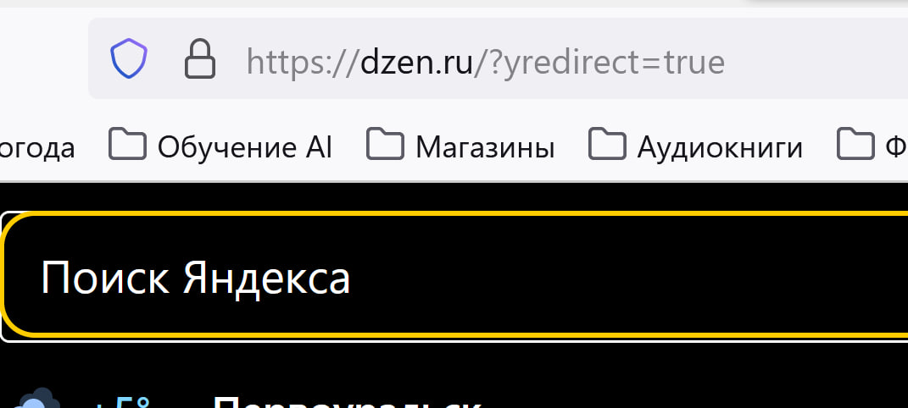
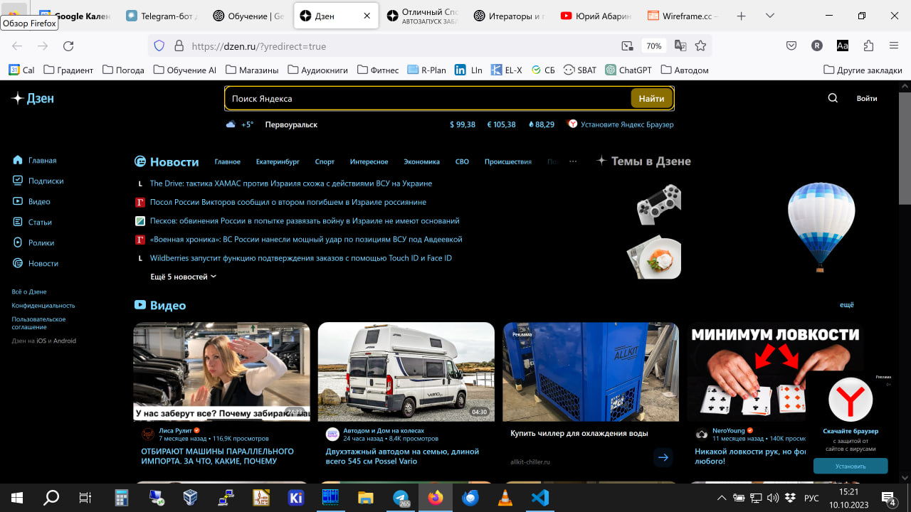
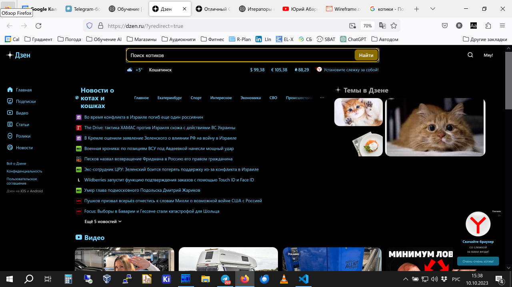
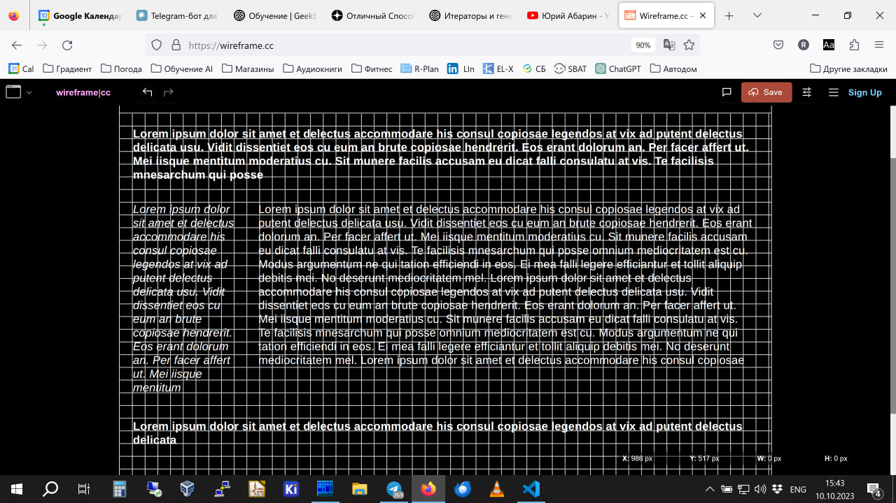

# Решение ДЗ семинара 1

## Веб-технологии: вчера, сегодня, завтра

Задача: на основе сайта yandex.ru:
Определите, на каком протоколе работает сайт.
Проанализируйте структуру страницы сайта.
Внесите не менее 10 изменений на страницу с помощью инструмента разработчика и представьте скриншоты было/стало.
Создайте прототип низкой детализации (дополнительное задание, если на семинаре дошли до задания №8).

## Решение

Сайт [yandex.ru](https://yandex.ru/) выполняет редирект на сайт [Дзен](https://dzen.ru/) и работает по протоколу HTTPS 

Структура страницы содержит:
* Хедер
* Меню сайта слева страницы
* Ленту новостей
* Бесконечная лента видеороликов

Сайт dzen.ru БЫЛО:

Сайт dzen.ru СТАЛО:

Прототип сайта низкой детализации:

